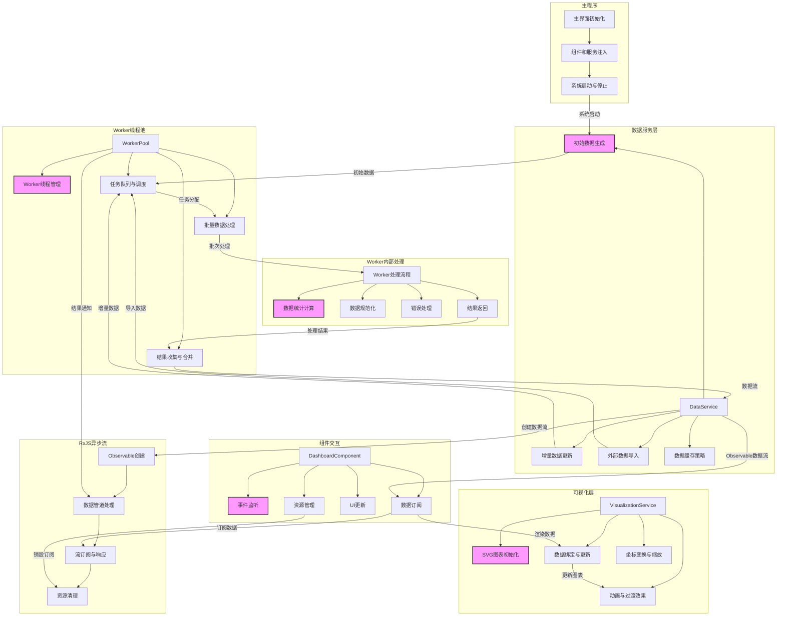
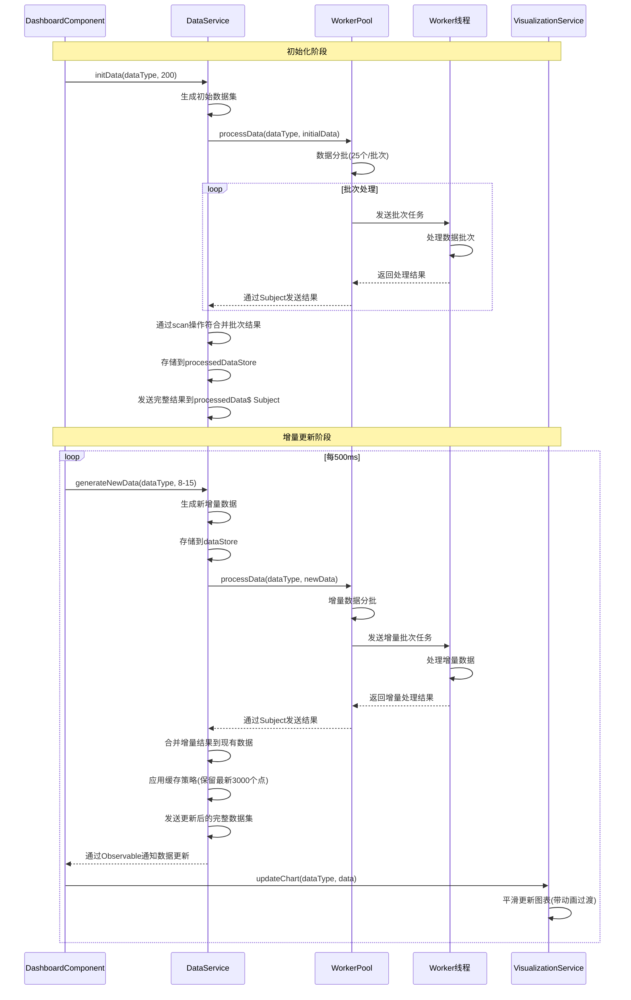
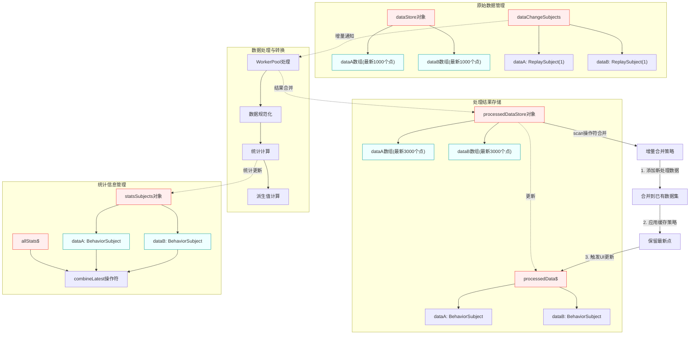

# RxJS + Angular + Web Worker 数据仪表盘架构

## 增量数据处理流程

## 数据存储与合并机制

## 关键组件详解

### 数据服务层 (DataService)
- **初始数据生成**：`initData(dataType, count)` - 生成初始数据集
- **增量数据更新**：`generateNewData(dataType, count)` - 定期生成新数据点
- **数据处理委托**：`processDataWithWorker(dataType, data)` - 使用Worker处理数据
- **数据流管理**：使用RxJS的Subject和BehaviorSubject管理多个数据流
- **缓存策略**：维护数据窗口大小，避免过多数据影响性能

### Worker线程池 (WorkerPool)
- **线程管理**：`initWorkers()` - 初始化和管理多个Worker线程
- **任务队列**：维护任务队列，按FIFO原则分配任务
- **任务调度**：`processNextTask()` - 高效分配任务到空闲Worker
- **批量处理**：将大数据集分割成小批次并行处理
- **结果收集**：`handleWorkerMessage()` - 收集并合并处理结果

### 可视化服务 (VisualizationService)
- **图表初始化**：`initChart(dataType, svgId)` - 创建SVG图表元素
- **动态更新**：`updateChart(dataType, data)` - 平滑更新图表数据
- **过渡动画**：使用CSS过渡效果实现平滑图表更新
- **自适应布局**：响应窗口大小变化，调整图表尺寸

### 仪表盘组件 (DashboardComponent)
- **生命周期管理**：`init()`和`destroy()` - 组件初始化和销毁
- **系统控制**：`startSystem()`和`stopSystem()` - 控制数据流处理
- **UI更新**：使用RxJS订阅数据变化，实时更新界面
- **资源管理**：正确管理订阅和定时器，防止内存泄漏

## RxJS异步数据流处理

整个系统广泛使用RxJS来管理异步数据流：
1. **数据源**：使用Subject和BehaviorSubject作为数据源
2. **数据转换**：使用map、filter、scan等操作符处理数据
3. **流合并**：使用merge、concat、combineLatest组合多个数据流
4. **错误处理**：使用retry和catchError处理异常
5. **资源管理**：使用takeUntil在组件销毁时取消所有订阅

## 核心改进点

1. **提高更新频率**：将更新间隔从2000ms降低到500ms，提供更实时的数据显示
2. **减小批处理大小**：从每批50个点减小到25个点，提高任务分配效率
3. **添加动画过渡**：使用CSS动画和贝塞尔曲线，使图表更新更加平滑
4. **优化Worker处理**：改进Worker内部处理逻辑，使用更高效的算法
5. **增加初始数据量**：从100个点增加到200个点，提供更丰富的起始图表显示 